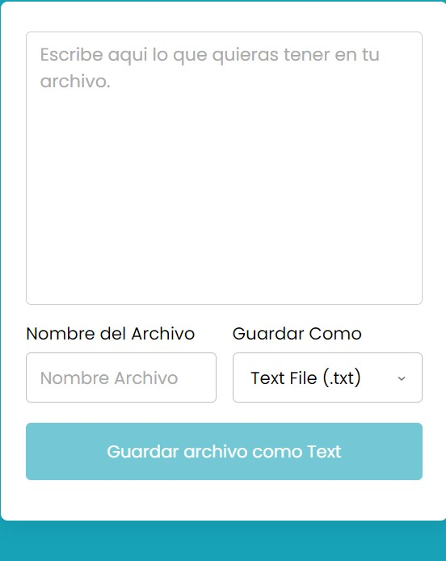
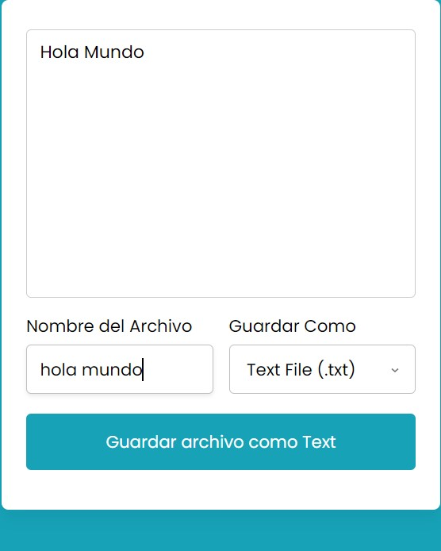
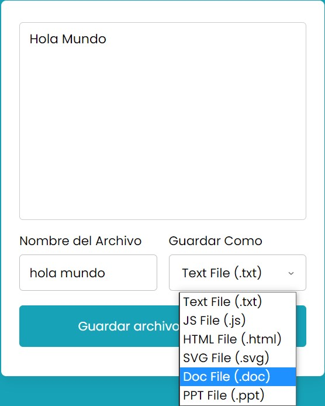
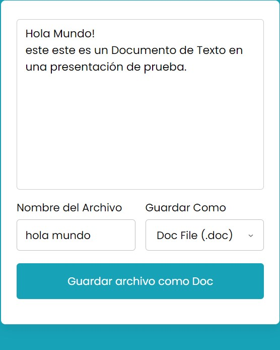
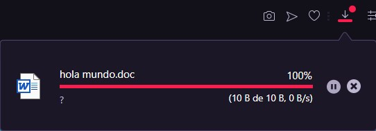
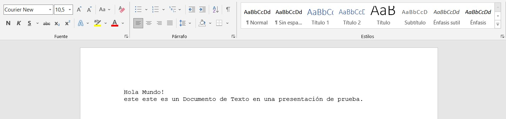
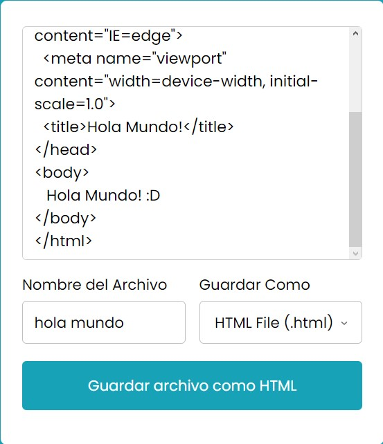
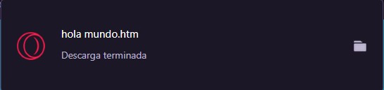
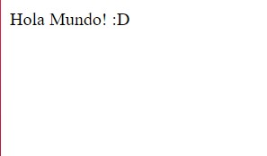

# Creador-de-Archivos
una pequeña pagina web hecha en HTML, CSS y JavaScript que nos permite crear archivos txt, js, html, svg, doc y ppt.  

  
    
  
    
  
  

## ¿Cuál es el fin de este proyecto?
Es una simple pagina hecha en HTML, CSS y JavaScript. 
Su objetivo no es mas que el aprendisaje y practica de herramientas que nos puede proporcionar JavaScript para la generación de archivos.

## ¿Puedo Probarlo en Linea? 
Si, Puedes probarlo en linea haciendo click [aqui](https://carlosorellana00.github.io/Creador-de-Archivos/)

## ¿Cómo puedo probarlo de manera local en mi equipo?
puede copiarse directamente desde git a traves de comando o descargarse en un archivo Zip, el proyecto no requiere de ningun servicio de servidor para correrse
de manera local en una computadora.

## Modo de uso

Para usar este programa debemos de ingresar a la vista,  el cual se nos presentara de la siguiente manera.

  

Posteriormente escribimos el contenido del archivo y su nombre, también debemos de elejir que tipo de archivo queremos que sea, en este caso para el ejemplo, sera un 
archivo de documento (.doc).

  

  

  

 
le daremos al botón de "Guardar Archivo", que nos dira "Guardar Archivo como Doc" y se procedera la descarga, creando un archivo tipo Documento que se guardara
en donde tengamos predispuesto para nuestras descargas

  

Podremos visualizar el documento en donde lo tengamos alojado y abrirlo, para ver que lo que escribimos esta en su contenido.

  

Podemos crear archivos HTML, pero para que estos se nos muerten en pantalla con detalle, debemos de escribir de forma completa la estructura.

  

se nos descargara igualmente de forma normal, como un archivo ".html"

  

y se ejecutara de forma normal, como cualquier archivo HTML

  

## Agradecimientos y Referencias:

- [Autor Original -> CodingNepal](https://www.youtube.com/c/CodingNepal)
- [Video Original -> How to Save Text As File in HTML CSS & JavaScript | Convert Text to File in JavaScript](https://www.youtube.com/watch?v=fAgLnRVHp_I&t=760s)

